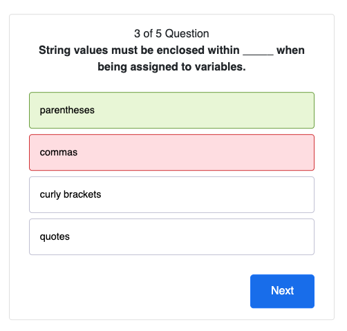

# Web-API-coding-quiz

## Description

This web app allows the user to take a timed quiz to test their knowledge on JavaScript fundamentals.

It has been created using a variety of basic web app design concepts, such as HTML, CSS, JS, web APIs and more, for the purpose of practicing said concepts in one project.

## Usage

Press the 'Get Started' button to start the quiz. 
The highscore board (from your local storage only) can also be accessed from this page.
The timer will count down when the quiz is started; the quiz will finish early if time runs out.

When an answer is selected, the correct answer will be highlighted green.
If an incorrect answer is selected, it will be highlighted red and the correct option will also be highlighted - as well as losing time on the clock!
Press the 'Next' button after reviewing your answer.

Once the quiz is completed, a screen with your results will be displayed.
Optionlal - you can enter your initials (or any wacky nicknames) to save your highscore (into your browser's local storage - don't worry, it's only for your reference).

Submitting the result will take you to the highscore board.
You can return to the quiz to try again, or clear the score board.

## Credits

CSS Styling sourced from Bootstrap <https://getbootstrap.com>

Code references include:
- 'Quiz App With JavaScript' by Coding Artist: <https://codingartistweb.com/2022/06/quiz-app-with-javascript/> (Majority of the base function & CSS has been based on this build - modifications made for other functions)

Other references:
- 'JavaScript Array sort()' by W3 Schools: <https://www.w3schools.com/jsref/jsref_sort.asp>; 

If otherwise not mentioned, base code references are from the learning materials provided by University of Adelaide (course code: UADEL-VIRT-FSF-PT-03-2023-U-LOLC)

## License

Licensed under MIT 
